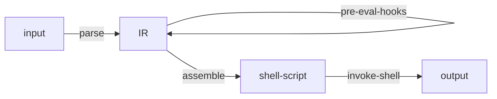
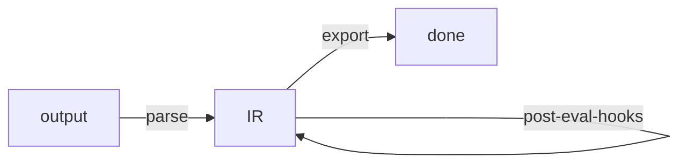

# envars

An Emacs package that provides an API for setting and unsetting environment
variables from files, strings, and pairs.

This package uses an `sh` subshell to evaluate environment variables. So, you
may define environment variables using shellisms.

## Installation

Example using straight:

```emacs-lisp
(straight-use-package
 '(envars :type git
          :host github
          :repo "cfclrk/envars"))
```

## API

### envars-set-file `(file-path)`

**[interactive]** Set environment variables defined in the file at FILE-PATH.

When used interactively, prompts for the file to load. The prompt begins in
`envars-dir`. When used from elisp, FILE-PATH can either be absolute or relative
to `default-directory`.

The env file at FILE-PATH should be in the standard env file format.

```emacs-lisp
(envars-set-file
 (expand-file-name "~/.env/foo"))
```

### envars-unset-file `(file-path)`

**[interactive]** Unset the environment variables defined in FILE-PATH.

See the documentation for `envars-set-file`.

```emacs-lisp
(envars-unset-file
 (expand-file-name "~/.env/foo"))
```

### envars-set-str `(str)`

Set environment variables defined in the given string STR.

Parse STR like an env file. STR is split into newline-delimited lines, where
each line is a key/value pair.

```emacs-lisp
(envars-set-str "FOO=foo\nBAR=bar")
```

### envars-unset-str `(str)`

Unset environment variables defined in string STR.

Parse STR like an env file. STR is split into newline-delimited pairs, where the
key of each pair is the environment variable name. The value of each pair is
discarded, as the environment variable will be unset regardless of its value.

```emacs-lisp
(envars-set-str "FOO=foo\nBAR=bar")
```

### envars-set-pairs `(pairs)`

Set the environment variables defined in the given PAIRS.

PAIRS is a list of pairs, where each pair is an environment variable name and
value.

```emacs-lisp
(envars-set-pairs '(("A" "a")
                    ("B" "'R$%!$KP$'")))
```

### envars-unset-pairs `(pairs)`

Unset the environment variables defined in the given PAIRS.

PAIRS is a list of pairs, where each pair is an environment variable name and
value. The value in each pair doesn't matter; each environment variable will be
unset regardless of its value.

```emacs-lisp
(envars-unset-pairs '(("FOO" "foo")
                      ("BAR" "bar")))
```

### envars-unset-names `(names)`

Unset environment variables with the given NAMES.

NAMES is a list of environment variable names which may or may not be currently
set. This function removes each given name from `process-environment` if it is
set.

```emacs-lisp
(envars-unset-names '("FOO" "BAR"))
```

## File Format

Each line in an env file must be in a `KEY=VALUE` format, with one entry per
line. This package invokes an `sh` shell to interpret the file, so shell-isms
technically should work. However, for compatability with other tools, it's best
to stick to the following minimal set of features:

- Use existing environment variables
- Define an environment variable and use it in successive lines
- A `~` is expanded if it is the first character in the value

## Usage from org-mode

The example below shows a convenient way to declare and set environment
variables in an `org` document using a table:

```org
#+NAME: env
| Var  | Value           |
|------+-----------------|
| FOO  | ~/foo           |
| BAR  | $FOO/bar        |
| BAZ  | '$FOO/bar'      |

#+begin_src emacs-lisp :var env=env
  (envars-set-pairs env)
#+end_src
```

## How it Works

When any of the public functions are called, the input is parsed into a list of pairs (the IR), assembled into a shell script, and then the shell script is run in an `sh` shell and the output is captured.

The way in:



The way out:



## Development

1. `make dep`: Install dependencies
2. `make test`: Run unit tests (you must run `make dep` first!)

## See Also

- [emacs-direnv](https://github.com/wbolster/emacs-direnv)
- [envrc](https://github.com/purcell/envrc)
- [parsenv](https://github.com/articuluxe/parsenv)
