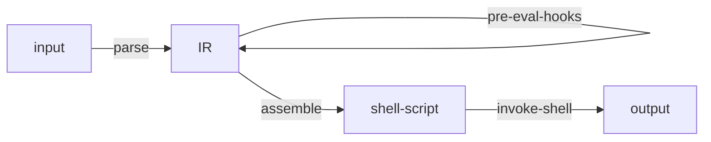
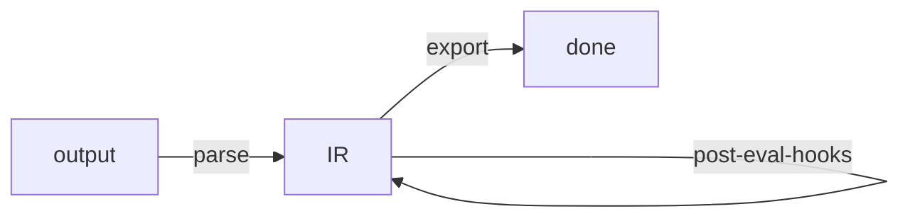

# envars

An Emacs package that provides an API for setting and unsetting environment
variables from files, strings, and pairs.

This package uses an `sh` subshell to evaluate environment variables. So, you
may define environment variables using shellisms.

## Installation

Example using straight:

```emacs-lisp
(straight-use-package
 '(envars :type git
          :host github
          :repo "cfclrk/envars"))
```

## API

### `envars-set-file` (interactive)

  Set all the environment variables defined in an env file. When used
  interactively, prompts for a file. By default, the prompt begins at
  `envars-dir`.

  ```emacs-lisp
  (envars-set-file
   (expand-file-name "~/.env/foo"))
  ```

### `envars-unset-file` (interactive)

  Unset all the environment variables defined in an env file. When used
  interactively, prompts for a file. By default, the prompt begins at
  `envars-dir`.

  ```emacs-lisp
  (envars-unset-file
   (expand-file-name "~/.env/foo"))
  ```

### `envars-set-str`

```emacs-lisp
(envars-set-str "FOO=foo\nBAR=bar")
```

### `envars-unset-str`

### `envars-set-pairs`

### `envars-unset-pairs`

## File Format

Each line in an env file must be in a `KEY=VALUE` format, with one entry per
line. This package invokes an `sh` shell to interpret the file, so shell-isms
technically should work. However, for compatability with other tools, it's best
to stick to the following minimal set of features:

- Use existing environment variables
- Define an environment variable and use it in successive lines
- A `~` is expanded if it is the first character in the value

## Usage from org-mode

The example below shows a convenient way to declare and set environment
variables in an `org` document using a table:

```org
#+NAME: env
| Var  | Value           |
|------+-----------------|
| FOO  | ~/foo           |
| BAR  | $FOO/bar        |
| BAZ  | '$FOO/bar'      |

#+begin_src emacs-lisp :var env=env
  (envars-set-pairs env)
#+end_src
```

## How it Works

The first thing this package does is convert input into a list of key/value
pairs (call it the "internal representation" or IR).

1. Parse input into an IR (a list of key/value pairs)
2. Run pre-eval hooks on the IR
3. Assemble into a shell script, evaluate, and parse result back into IR
4. Run post-eval hooks on the IR
5. Set (or return) the resulting list of key/value pairs as environment variables

The way in:



The way out:



## Development

1. `make dep`: Install dependencies
2. `make test`: Run unit tests (you must run `make dep` first!)

## See Also

- [emacs-direnv](https://github.com/wbolster/emacs-direnv)
- [envrc](https://github.com/purcell/envrc)
- [parsenv](https://github.com/articuluxe/parsenv)
