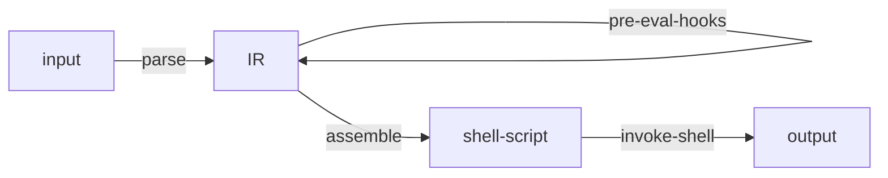
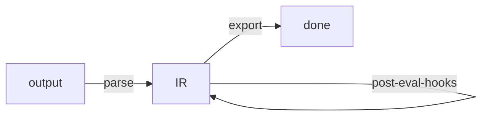

# env

An Emacs package that provides some helpful functions for working with
environment variables and env files.

This package uses an `sh` subshell to evaluate environment variables. So, you
may define environment variables using shellisms.

## Table of Contents

- [API](#api)
  - [env-set-file `(file-path)`](#env-set-file-file-path)
  - [env-unset-file `(file-path)`](#env-unset-file-file-path)
  - [env-set-str `(str)`](#env-set-str-str)
  - [env-unset-str `(str)`](#env-unset-str-str)
  - [env-set-pairs `(pairs)`](#env-set-pairs-pairs)
  - [env-unset-pairs `(pairs)`](#env-unset-pairs-pairs)
  - [env-get-names](#env-get-names)
  - [env-unset-names `(names)`](#env-unset-names-names)
  - [env-unset-name `(name)`](#env-unset-name-name)
- [File Format](#file-format)
- [Usage from org-mode](#usage-from-org-mode)
- [How it Works](#how-it-works)
- [See Also](#see-also)

## Example Usage

Install with something like:

```emacs-lisp
(use-package env
  :demand t
  :elpaca (env
           :host github
           :repo "cfclrk/env")
  :config
  (setq env-dir (expand-file-name "~/.env/")))
```

Create an env file with the following contents at `~/.env/foo`:

```sh
FOO=~/foo
BAR=$FOO/bar
BAZ=$(pwd)
```

Now, run `M-x env-set-file`, which will prompt for a file. Navigate to
`~/.env/foo` and press Enter. Voilà, you have three new environment variables
set in Emacs! Check them with `M-x getenv`. Unset them with `M-x env-unset-file` (this will again prompt for a file).

Besides setting (and unsetting) environment variables from env files, this package provides an API for some common operations on environment variables.

## API

### env-set-file `(file-path)`

**[interactive]** Set environment variables defined in the file at FILE-PATH.

When used interactively, prompts for the file to load. The prompt begins in
`env-dir`. When used from elisp, FILE-PATH can either be absolute or relative
to `default-directory`.

The env file at FILE-PATH should be in the standard env file format.

```emacs-lisp
(env-set-file
 (expand-file-name "~/.env/foo"))
```

### env-unset-file `(file-path)`

**[interactive]** Unset the environment variables defined in FILE-PATH.

See the documentation for `env-set-file`.

```emacs-lisp
(env-unset-file
 (expand-file-name "~/.env/foo"))
```

### env-set-str `(str)`

Set environment variables defined in the given string STR.

Parse STR like an env file. STR is split into newline-delimited lines, where
each line is a key/value pair.

```emacs-lisp
(env-set-str "FOO=foo\nBAR=bar")
```

### env-unset-str `(str)`

Unset environment variables defined in string STR.

Parse STR like an env file. STR is split into newline-delimited pairs, where the
key of each pair is the environment variable name. The value of each pair is
discarded, as the environment variable will be unset regardless of its value.

```emacs-lisp
(env-unset-str "FOO=foo\nBAR=bar")
```

### env-get-pairs

Return all current environment variables as a list of pairs.

```emacs-lisp
(env-get-pairs)
;; => (("LANG" "en_US.UTF-8")
;;     ("HOME" "/Users/cfclrk")
;;     ...)
```

### env-set-pairs `(pairs)`

Set the environment variables defined by the given PAIRS.

PAIRS is a list of pairs, where each pair is an environment variable name and
value.

```emacs-lisp
(env-set-pairs '(("FOO" "foo")
                 ("BAR" "$FOO-bar")))

;; Prevent interpolation using single quotes
(env-set-pairs '(("A" "a")
                 ("B" "'$FOO-bar'")))
```

### env-unset-pairs `(pairs)`

Unset the environment variables defined in the given PAIRS.

PAIRS is a list of pairs, where each pair is an environment variable name and
value. The value in each pair doesn't matter; each environment variable will be
unset regardless of its value.

```emacs-lisp
(env-unset-pairs '(("FOO" "foo")
                   ("BAR" "bar")))
```

### env-get-names

Return a list of all current environment variable names.

```emacs-lisp
(env-get-names)

;; => ("HOME" "FOO" "BAR")
```

### env-unset-names `(names)`

Unset environment variables with the given NAMES.

NAMES is a list of environment variable names which may or may not be currently
set. This function removes each name from `process-environment` if it is set.

```emacs-lisp
(env-unset-names '("FOO" "BAR"))
```

### env-unset-name `(name)`

**[interactive]** Unset the environment variable NAME.

Unset the given environment variable by removing it from `process-environment`
if it is there. Note that calling `setenv` with a prefix argument can 'unset' a
variable by setting its value to nil, but the variable remains in
`process-environment`. This function completely removes the variable from
`process-environment`.

Neither Emacs nor bash directly support non-ASCII characters as environment
variables (see [The Open Group][tog]), but Emacs can fake it by using escaped
sequences of unicode code points.

[tog]: https://pubs.opengroup.org/onlinepubs/9699919799/

## File Format

Each line in an env file must be in a `KEY=VALUE` format, with one entry per
line. This package invokes an `sh` shell to interpret the file, so shellisms
should work (like `~` expansion or using single quotes to prevent variable
interpolation).

For example:

```text
A=foo
B="bar"
C='R$%!$KP$'
D=$A-bar
E=~/cats
```

## Usage from org-mode

The example below shows a convenient way to declare and set environment
variables in an `org` document using a table:

```org
#+NAME: env
| Var  | Value           |
|------+-----------------|
| FOO  | ~/foo           |
| BAR  | $FOO/bar        |
| BAZ  | '$FOO/bar'      |

#+begin_src emacs-lisp :var env=env
  (env-set-pairs env)
#+end_src
```

## How it Works

When any of the public functions are called, the input is parsed into a list of pairs (the IR), assembled into a shell script, and then the shell script is run in an `sh` shell and the output is captured.

The way in:



The way out:



## See Also

- [emacs-direnv](https://github.com/wbolster/emacs-direnv)
- [envrc](https://github.com/purcell/envrc)
- [parsenv](https://github.com/articuluxe/parsenv)
